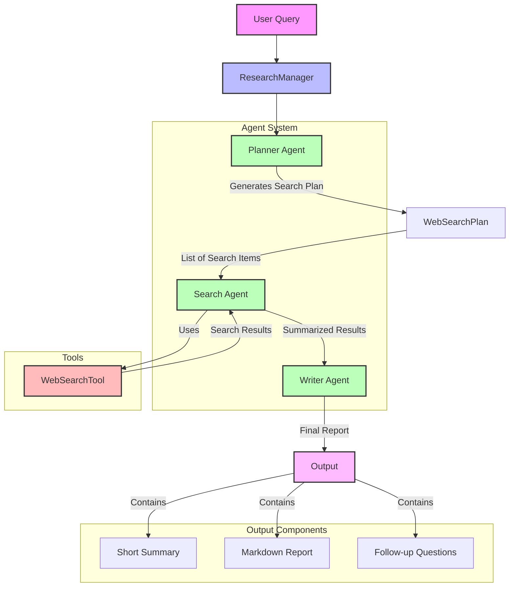

# Agent System Flow Diagram

## Diagram Explanation

The diagram shows:

1. **Flow Direction**: Top to bottom showing the progression from user query to final output
2. **Components**:
   - User Query (pink)
   - ResearchManager (blue)
   - Agents (green)
   - Tools (red)
   - Output (purple)
3. **Subgraphs** to group related components:
   - Agent System (contains all three agents)
   - Tools (contains the WebSearchTool)
   - Output Components (contains the three parts of the final report)

The arrows show the data flow between components, with labels indicating what's being passed between them. 